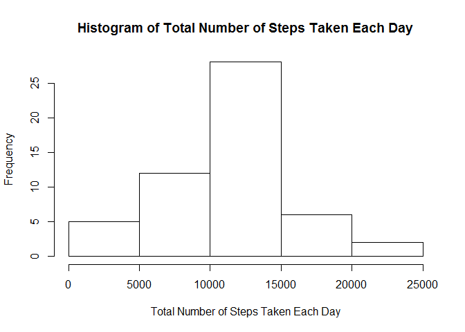
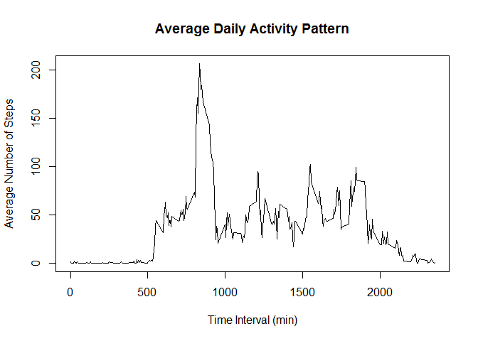
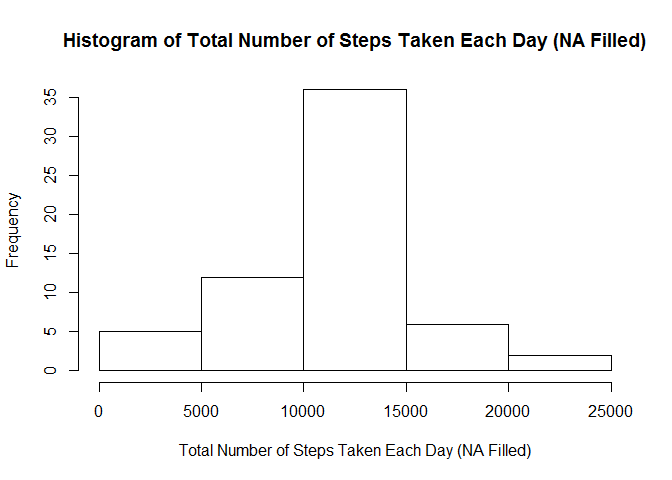
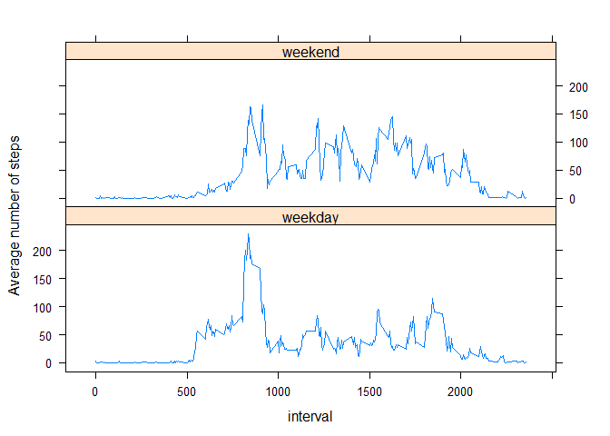

# Reproducible Research: Peer Assessment 1


## Loading and preprocessing the data  
1. Load the data.  

```r
activity<-read.csv(unz("activity.zip","activity.csv"))
```
2. Process the data: convert the date variables into class "Date".  

```r
 activity$date<-as.Date(activity$date,"%Y-%m-%d")
```

## What is mean total number of steps taken per day?
1. Plot the histogram of the total number of steps taken per day  

```r
total<-with(activity,tapply(steps,date,sum))
hist(total,xlab="Total Number of Steps Taken Each Day",  
     main="Histogram of Total Number of Steps Taken Each Day")
```

<!-- -->

2. Find out the mean and median of the total number of steps taken per day  

```r
mn<-mean(total,na.rm=TRUE)
mdn<-median(total,na.rm=TRUE)
```
The mean of the total number of steps taken per day is 1.0766189\times 10^{4}.  
The median of the total number of steps taken per day is 10765.

## What is the average daily activity pattern?
1. Make a time series plot of the 5-minute interval and the average number of steps taken, averaged across all days  

```r
avg<-with(activity,tapply(steps,interval,function(x) mean(x,na.rm=TRUE)))
plot(as.numeric(names(avg)),avg,type="l",
     main="Average Daily Activity Pattern",
     xlab="Time Interval (min)",
     ylab="Average Number of Steps")
```

<!-- -->

2. Find out the 5-minute interval that, on average across all the days, contains the maximum number of steps

```r
max_interval<-names(avg[avg==max(avg)])
```
The 5-minute interval that, on average across all the days, contains the maximum number of steps is 835.

## Imputing missing values
1. Find out the total number of missing values in the dataset.

```r
sum_na<-sum(is.na(activity$steps))
```
The total number of missing values in the dataset is 2304.
    
2. File in all of the missing values in the dataset with the mean of that day and create a new dataset.

```r
nafilled<-activity
row_index<-which(is.na(nafilled$steps))
for(i in row_index){
    nafilled$steps[i]<-avg[as.character(nafilled$interval[i])]
}
```
3. Based on the new dataset, make a histogram of the total number of steps taken each day and find out the mean and median total number of steps taken per day. 

```r
total_new<-with(nafilled,tapply(steps,date,sum))
hist(total_new,xlab="Total Number of Steps Taken Each Day (NA Filled)",  
     main="Histogram of Total Number of Steps Taken Each Day (NA Filled)")
```

<!-- -->

```r
mn_new<-mean(total_new)
mdn_new<-median(total_new)
```
The mean total number of steps taken per day with missing data filled is 1.0766189\times 10^{4}.  
The median total number of steps taken per day with missing data filled is 1.0766189\times 10^{4}.

The new mean is the same as the estimate from the first part of the assignment because the missing values are filled with the mean value. The new median differs from the estimate from the first part of the assignment because imputing missing data with mean makes the data more evenly distributed around the mean, i.e., new median is closer to mean.

## Are there differences in activity patterns between weekdays and weekends?
1. Create a new factor variable in the dataset with two levels – “weekday” and “weekend” indicating whether a given date is a weekday or weekend day.

```r
nafilled$week<-ifelse(weekdays(nafilled$date)%in%c("Saturday","Sunday"),
                      nafilled$week<-"weekend",nafilled$week<-"weekday")
nafilled$week<-as.factor(nafilled$week)
```
2. Make a panel plot containing a time series plot of the 5-minute interval and the average number of steps taken, averaged across all weekday days or weekend days.

```r
library(lattice)
library(stats)
nafilled_avg<-aggregate(steps~week+interval,nafilled,mean)
xyplot(steps~interval|week,data=nafilled_avg,layout=c(1,2),type="l",
       ylab="Average number of steps")
```

<!-- -->
