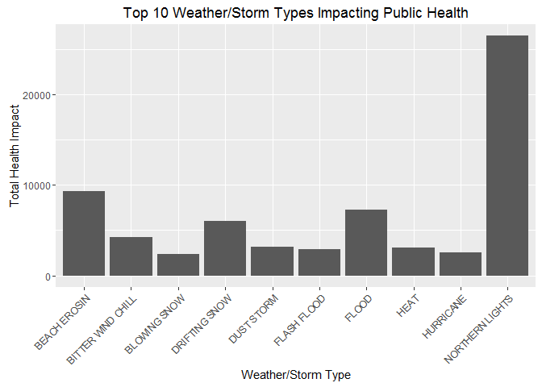
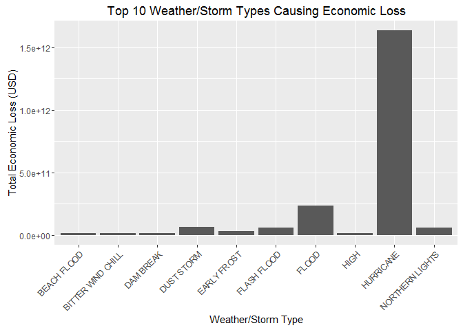

# Impact of Severe Weather Events in the US


## Synopsis    
Storms and other severe weather events can cause both public health and economic problems for communities and municipalities. Many severe events can result in fatalities, injuries, and property damage, and preventing such outcomes to the extent possible is a key concern.  

This project explores the U.S. National Oceanic and Atmospheric Administration's (NOAA) storm database. Major storms and weather events occured from 1950 to November 2011 in the United States are analyzed. The types of events that are most harmful to the population health and those that have the greatest economic consequences are identified.


## Data Processing   

### Load the data
The data for this project are in the form of a comma-separated-value file compressed via bzip2. The data were loaded into R with the following code:      

```r
stormdata<-read.csv("StormData.csv.bz2")
```

### Load the packages  

```r
library(dplyr)
```

```
## 
## Attaching package: 'dplyr'
```

```
## The following objects are masked from 'package:stats':
## 
##     filter, lag
```

```
## The following objects are masked from 'package:base':
## 
##     intersect, setdiff, setequal, union
```

```r
library(stringr)
library(stringdist)
library(ggplot2)
```

### Process the data
**Select columns of interest.**  

```r
storm<-stormdata %>% select(EVTYPE,BGN_DATE,FATALITIES,INJURIES,PROPDMG:CROPDMGEXP) %>%
    mutate(BGN_DATE=as.Date(BGN_DATE,"%m/%d/%Y")) %>%
    filter(BGN_DATE>="1991-11-01")
```
Note: Since there are fewer events recorded in the earlier years of the database due to a lack of good records, only records from the most recent 20 years (11/1991-11/2011) were considered in this analysis, i.e., 728544 records out of 902297 records were analyzed.  

**Re-compute amount of damages.**  
Characters used to signify magnitude include "K" for thousands, "M" for millions, and "B" for billions in columns *PROPDMGEXP* and *CROPDMGEXP* were converted and applied to columns *PROPDMG* and *CROPDMG*. 

```r
storm<-storm %>% mutate(
    PROPDMGEXP=ifelse(PROPDMGEXP %in% c("k","K"),1e3,
                   ifelse(PROPDMGEXP %in% c("m","M"),1e6,
                          ifelse(PROPDMGEXP %in% c("b","B"),1e9,1))),
    CROPDMGEXP=ifelse(CROPDMGEXP %in% c("k","K"),1e3,
                   ifelse(CROPDMGEXP %in% c("m","M"),1e6,
                          ifelse(CROPDMGEXP %in% c("b","B"),1e9,1)))
)

storm<-storm %>% mutate(PROPDMG_COST=PROPDMG*PROPDMGEXP,
                        CROPDMG_COST=CROPDMG*PROPDMGEXP)
```

**Clean up event types.** 

```r
type_len<-length(levels(storm$EVTYPE))
example<-tail(levels(storm$EVTYPE),10)
```
There are 985 unique event types contained in the *EVTYPE* column of the dataset, while there are only 48 event names officially assigned. Also, the event types in the dataset are very messy. Some have misspelled words, and most of them are not properly categorized. For example, 10 of the unique event types in the dataset are:  
WINTER STORMS, Winter Weather, WINTER WEATHER, WINTER WEATHER MIX, WINTER WEATHER/MIX, WINTERY MIX, Wintry mix, Wintry Mix, WINTRY MIX, WND  

Therefore, String Distance {stringdist} using *Jaro-Winkler* distance algorithm was used to cluster these event types.   

```r
# Basic clean up of EVTYPE 
storm<-storm %>% mutate(EVTYPE=str_trim(toupper(EVTYPE)),
                        EVTYPE=str_replace_all(EVTYPE,fixed("/ "),"/")) %>%
    arrange(BGN_DATE)

# Clustering
set.seed(30)
type<-unique(storm$EVTYPE)
distmodel<-stringdistmatrix(type,type,method="jw")
rownames(distmodel)<-type
type_hc<-hclust(as.dist(distmodel))
dfclust<-data.frame(type,cutree(type_hc,k=48))
names(dfclust) <- c("ev_type","cluster")
storm_clust<-merge(x=storm,y=dfclust,by.x="EVTYPE",by.y="ev_type",all.x=T)
 
# Summarize data for each cluster,the first event name within each cluster is used to name that cluster
storm_summary<-storm_clust %>% group_by(cluster) %>% 
    summarize(EVTYPE=first(EVTYPE),
              FATALITIES=sum(FATALITIES,na.rm=T),
              INJURIES=sum(INJURIES,na.rm=T),
              PROPDMG_COST=sum(PROPDMG_COST,na.rm=T),
              CROPDMG_COST=sum(CROPDMG_COST,na.rm=T)) %>% ungroup()
```

## Results  

### Storms Impacting Public Health
The sum of fatalities and injuries for each cluster was calculated and the top 10 were chosen and reported in the plot.   

```r
storm_health<-storm_summary %>% mutate(HEALTH=FATALITIES+INJURIES) %>%
    arrange(desc(HEALTH)) %>% slice(1:10)

x<-ggplot(storm_health,aes(x=EVTYPE, y=HEALTH))+ 
    geom_bar(stat='identity',position="dodge")+
    labs(x="Weather/Storm Type",y="Total Health Impact",
         title="Top 10 Weather/Storm Types Impacting Public Health")+
    theme(axis.text.x=element_text(angle=45, hjust=1))
print(x)
```

<!-- -->

### Storms Causing Economic Loss
The sum of crop damages and property damages for each cluster was calculated and the top 10 were chosen and reported in the plot.  

```r
storm_cost<-storm_summary %>% mutate(COST=PROPDMG_COST+CROPDMG_COST) %>%
    arrange(desc(COST)) %>% slice(1:10)

y<-ggplot(storm_cost,aes(x=EVTYPE, y=COST))+ 
    geom_bar(stat='identity',position="dodge")+
    labs(x="Weather/Storm Type",y="Total Economic Loss (USD)",
         title="Top 10 Weather/Storm Types Causing Economic Loss")+
    theme(axis.text.x=element_text(angle=45, hjust=1))
print(y)
```

<!-- -->


