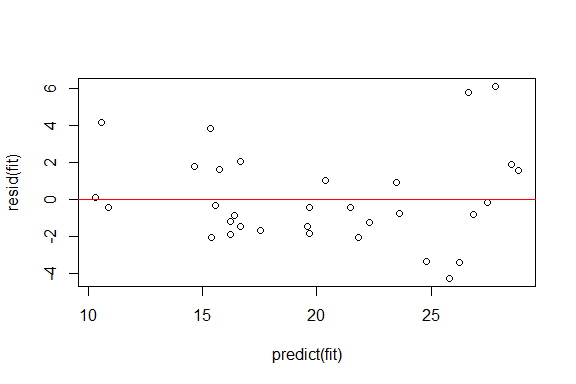
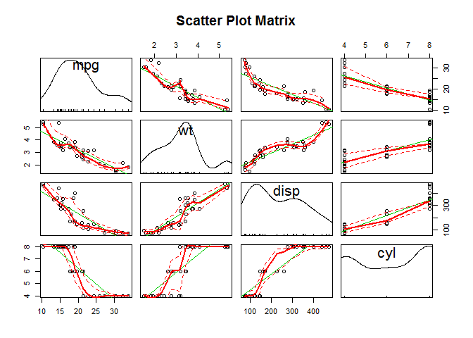
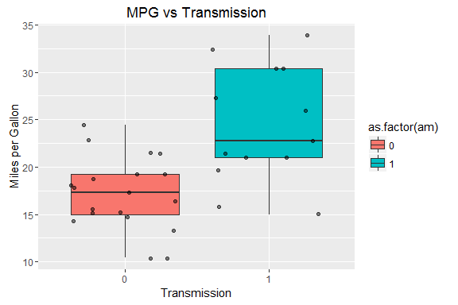

# Analysis of mtcars Data Set
Yanfei Wu  
June 20, 2016  


## Executive Summary
This report analyzes the *mtcars* data set in R with some exploratory data analyses and regression models. The relationship between a set of variables and miles per gallon (MPG) is investigated. Specificially, the report tries to answer two questions:   
1. Is an automatic or manual transmission better for MPG?  
2. Can we quantify the MPG difference between automatic and manual transmissions?  

## Analysis  
### I. Exploratory Data Analyses  

```r
data(mtcars)
str(mtcars)
```

```
## 'data.frame':	32 obs. of  11 variables:
##  $ mpg : num  21 21 22.8 21.4 18.7 18.1 14.3 24.4 22.8 19.2 ...
##  $ cyl : num  6 6 4 6 8 6 8 4 4 6 ...
##  $ disp: num  160 160 108 258 360 ...
##  $ hp  : num  110 110 93 110 175 105 245 62 95 123 ...
##  $ drat: num  3.9 3.9 3.85 3.08 3.15 2.76 3.21 3.69 3.92 3.92 ...
##  $ wt  : num  2.62 2.88 2.32 3.21 3.44 ...
##  $ qsec: num  16.5 17 18.6 19.4 17 ...
##  $ vs  : num  0 0 1 1 0 1 0 1 1 1 ...
##  $ am  : num  1 1 1 0 0 0 0 0 0 0 ...
##  $ gear: num  4 4 4 3 3 3 3 4 4 4 ...
##  $ carb: num  4 4 1 1 2 1 4 2 2 4 ...
```
The *mtcars* data is a data frame with 32 observations on 11 variables. Since we are interested in examing factors that affact MPG, the correlation coefficients between *MPG and the remaining 10 variables* are calculated below and a scatterplot matrix of selected variables is included in **Appendix**.    

```r
require(stats)
round(cor(mtcars)[-1, 1], 2)
```

```
##   cyl  disp    hp  drat    wt  qsec    vs    am  gear  carb 
## -0.85 -0.85 -0.78  0.68 -0.87  0.42  0.66  0.60  0.48 -0.55
```
Apparently, most of the variables show moderate to strong correlations with MPG (|coefficients| > 0.5). We also note that the remaining 10 variables themselves are more or less correlated . For example, correlations between *number of cylinders and other variables* have the coefficients of:  

```r
round(cor(mtcars)[-2, 2], 2)
```

```
##   mpg  disp    hp  drat    wt  qsec    vs    am  gear  carb 
## -0.85  0.90  0.83 -0.70  0.78 -0.59 -0.81 -0.52 -0.49  0.53
```
The variable that we are particularly interested in here is the transmission ("am": 0-auto, 1-manual). To examine it, we simply plot "mpg" vs "am" as shown in **Appendix**.   

### II. Model Fitting and Model Selection  
From the exploratory data analyses, we know that we are dealing with a multivariable regression problem with many of the variables correlated. We are particularly interested in examining the effect of transmission. But according to the correlation coefficients, "wt", "cyl" and "disp" show the strongest correlations with "mpg". So we compare the following several models.   

```r
fit0 <- lm(mpg ~ am, data = mtcars)
## Model 0: MPG ~ transmission
fit1 <- lm(mpg ~ wt + cyl + disp, data = mtcars)
## Model 1: MPG ~ weight + number of cylinders + displacement
fit2 <- lm(mpg ~ wt + hp + cyl + disp + am, data = mtcars)
## Model 2: MPG ~ weight + number of cylinders + displacement + transmission
fit3 <- lm(mpg ~ ., data = mtcars)
## Model 3: MPG ~ all variables
```
Since we are interested in answering if auto (am = 0) or manual (am = 1) transmission is better, we can fit MPG only with transmission, and we get:  

```r
summary(fit0)
```

```
## 
## Call:
## lm(formula = mpg ~ am, data = mtcars)
## 
## Residuals:
##     Min      1Q  Median      3Q     Max 
## -9.3923 -3.0923 -0.2974  3.2439  9.5077 
## 
## Coefficients:
##             Estimate Std. Error t value Pr(>|t|)    
## (Intercept)   17.147      1.125  15.247 1.13e-15 ***
## am             7.245      1.764   4.106 0.000285 ***
## ---
## Signif. codes:  0 '***' 0.001 '**' 0.01 '*' 0.05 '.' 0.1 ' ' 1
## 
## Residual standard error: 4.902 on 30 degrees of freedom
## Multiple R-squared:  0.3598,	Adjusted R-squared:  0.3385 
## F-statistic: 16.86 on 1 and 30 DF,  p-value: 0.000285
```
The coefficients tell us that with manual transmission MPG increases by 7.245 miles/Gallon. The p value is < 0.05, indicating that the difference for manual transmission is significant. But the adjusted R^2 in this case is only 0.3385. Clearly, the coefficients obtained here is biased without considering other variables.  

If we fit MPG with weight, number of cylinders and displacement, which have large correlation coefficients with MPG, we get:   

```r
summary(fit1)
```

```
## 
## Call:
## lm(formula = mpg ~ wt + cyl + disp, data = mtcars)
## 
## Residuals:
##     Min      1Q  Median      3Q     Max 
## -4.4035 -1.4028 -0.4955  1.3387  6.0722 
## 
## Coefficients:
##              Estimate Std. Error t value Pr(>|t|)    
## (Intercept) 41.107678   2.842426  14.462 1.62e-14 ***
## wt          -3.635677   1.040138  -3.495  0.00160 ** 
## cyl         -1.784944   0.607110  -2.940  0.00651 ** 
## disp         0.007473   0.011845   0.631  0.53322    
## ---
## Signif. codes:  0 '***' 0.001 '**' 0.01 '*' 0.05 '.' 0.1 ' ' 1
## 
## Residual standard error: 2.595 on 28 degrees of freedom
## Multiple R-squared:  0.8326,	Adjusted R-squared:  0.8147 
## F-statistic: 46.42 on 3 and 28 DF,  p-value: 5.399e-11
```
We see that the adjusted R^2 is 0.8147. The p values show that both weight and number of cylinders have significant linear relationships with MPG, but the  displacement does not.   

We also compare models with more variables added over model 1 as follows:  

```r
anova(fit1, fit2, fit3)
```

```
## Analysis of Variance Table
## 
## Model 1: mpg ~ wt + cyl + disp
## Model 2: mpg ~ wt + hp + cyl + disp + am
## Model 3: mpg ~ cyl + disp + hp + drat + wt + qsec + vs + am + gear + carb
##   Res.Df    RSS Df Sum of Sq      F Pr(>F)
## 1     28 188.49                           
## 2     26 163.12  2    25.372 1.8062 0.1889
## 3     21 147.49  5    15.625 0.4449 0.8121
```
From the p values, adding transmission and all other variables over model 1 is not necessary.  

Now, We can construct a new model with only weight and number of cylinders to predict MPG. The residual plot is shown below and does not show regular pattern.

```r
fit <- lm(mpg ~ wt + cyl, data = mtcars)
plot(predict(fit), resid(fit))
abline(h = 0, col = "red")
```



## Conclusions   
From the analyses above, MPG is mainly related to vehicle weight and number of cylinders. Manual transmission is better than auto transmission on MPG. But with the given data set, we are unable to correctly quantify the difference between the two types of transmissions on MPG.  


## Appendix    

<!-- -->


