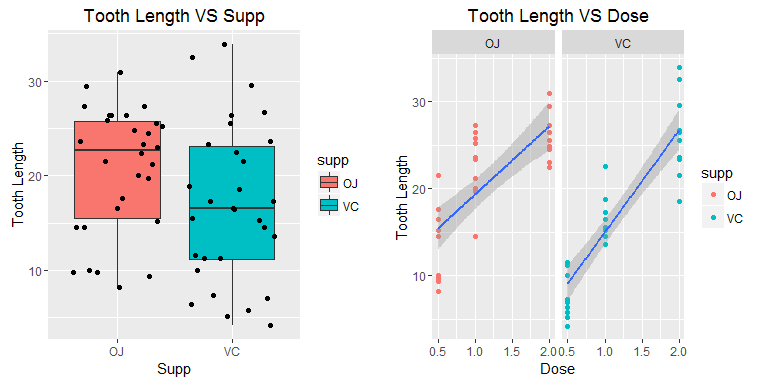
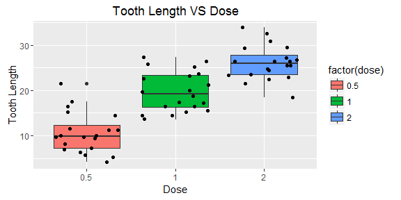
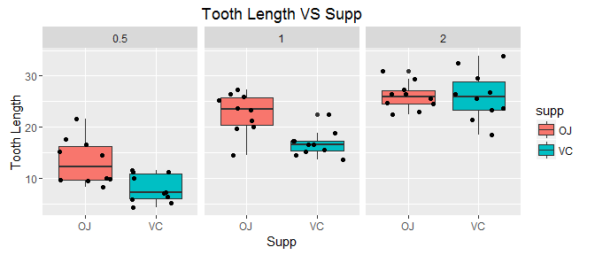

# ToothGrowth Data Analysis
Yanfei Wu  
June 17, 2016  


## Introduction  
This project analyzes the ToothGrowth data in the R datasets package. Some basic exploratory data analyses are performed and a basic summary of the data is given. Also, the confidence intervals and hypothesis tests are used to compare tooth growth by supp and dose.  

## Analysis  
### I. Exploratory Data Analysis  
**Load Data and Basic Information**  
First, the data is loaded into R. The structure of the data is shown below: 

```r
data(ToothGrowth)
str(ToothGrowth)
```

```
## 'data.frame':	60 obs. of  3 variables:
##  $ len : num  4.2 11.5 7.3 5.8 6.4 10 11.2 11.2 5.2 7 ...
##  $ supp: Factor w/ 2 levels "OJ","VC": 2 2 2 2 2 2 2 2 2 2 ...
##  $ dose: num  0.5 0.5 0.5 0.5 0.5 0.5 0.5 0.5 0.5 0.5 ...
```
As we can see, it is a data frame with 60 observations on 3 variables. A summary of the three variables is given by:  

```r
summary(ToothGrowth)
```

```
##       len        supp         dose      
##  Min.   : 4.20   OJ:30   Min.   :0.500  
##  1st Qu.:13.07   VC:30   1st Qu.:0.500  
##  Median :19.25           Median :1.000  
##  Mean   :18.81           Mean   :1.167  
##  3rd Qu.:25.27           3rd Qu.:2.000  
##  Max.   :33.90           Max.   :2.000
```

**Basic Visulization**  
The data is then visualized. First, the dependences of the tooth length on supp and dose are plotted. We know that supp is a factor variable with two different levels, so we can plot tooth length vs dose by supp.  

```r
library(ggplot2)
require(gridExtra)
```

```
## Loading required package: gridExtra
```

```r
plot1 <- ggplot(ToothGrowth, aes(x = supp, y = len)) +
    geom_boxplot(aes(fill = supp)) + geom_jitter() +
    labs(x = "Supp", y = "Tooth Length", title = "Tooth Length VS Supp")
plot2 <- ggplot(ToothGrowth, aes(x = dose, y = len)) + 
    geom_point(aes(color = supp)) + geom_smooth(method = "lm") +
    facet_grid(. ~ supp) +
    labs(x = "Dose", y = "Tooth Length", title = "Tooth Length VS Dose")
grid.arrange(plot1, plot2, ncol = 2)
```



From the right figure we see that there are 3 distinct dose levels. So alternatively, we can visualize tooth length vs dose as below:    

```r
ggplot(ToothGrowth, aes(x = factor(dose), y = len)) + 
    geom_boxplot(aes(fill = factor(dose))) + geom_jitter() +
    labs(x = "Dose", y = "Tooth Length", title = "Tooth Length VS Dose")
```



Further, the difference between the 2 supp can be split by dose as follows:   

```r
ggplot(ToothGrowth, aes(x = supp, y = len)) + 
    geom_boxplot(aes(fill = supp)) + geom_jitter() +
    facet_grid(.~ dose) +
    labs(x = "Supp", y = "Tooth Length", title = "Tooth Length VS Supp")
```


**Basic Calculations**  
More quantitatively, we can calculate the mean and standard deviations of the tooth length by different groups. The **mean and standard deviation of tooth length with different supp** are given by: 

```r
supp_df <- data.frame(tapply(ToothGrowth$len,ToothGrowth$supp,mean),
                      tapply(ToothGrowth$len,ToothGrowth$supp,sd),
                      tapply(ToothGrowth$len,ToothGrowth$supp,length))
colnames(supp_df) <- c("mean", "sd", "count")
supp_df
```

```
##        mean       sd count
## OJ 20.66333 6.605561    30
## VC 16.96333 8.266029    30
```
And the **mean and standard deviation of tooth length with different dose** are given by:  

```r
dose_df <- data.frame(tapply(ToothGrowth$len,as.factor(ToothGrowth$dose),mean),
                      tapply(ToothGrowth$len,as.factor(ToothGrowth$dose),sd),
                      tapply(ToothGrowth$len,as.factor(ToothGrowth$dose),length))
colnames(dose_df) <- c("mean", "sd", "count")
dose_df
```

```
##       mean       sd count
## 0.5 10.605 4.499763    20
## 1   19.735 4.415436    20
## 2   26.100 3.774150    20
```
Further, the **mean and standard deviation of tooth length by both supp and dose** are given below:

```r
df <- aggregate(len ~ supp + dose, data = ToothGrowth, 
          FUN = function(x) c(mean = mean(x), sd = sd(x), count = length(x)))
colnames(df) <- NULL
df
```

```
##               mean        sd     count
## 1 OJ 0.5 13.230000  4.459709 10.000000
## 2 VC 0.5  7.980000  2.746634 10.000000
## 3 OJ 1.0 22.700000  3.910953 10.000000
## 4 VC 1.0 16.770000  2.515309 10.000000
## 5 OJ 2.0 26.060000  2.655058 10.000000
## 6 VC 2.0 26.140000  4.797731 10.000000
```

**Data Summary**  
Overall, the data compares tooth length of 2 supp (OJ and VC), each with 30 observations. Three different doses (0.5, 1.0, and 2.0) are compared within each group of 30 observations (10 observations for each dose). It seems that the tooth lengh depends both on the dose and the supp. There is a clear positive dependence of the tooth length on dose. As with different supp, the tooth length with OJ is slightly larger than that with VC, except for the case when dose is 2.0 (mean tooth length for OJ and VC is roughly the same).  

### II. Confidence Intervals and Hypothesis Tests   
Confidence intervals and hypothesis tests are used to more rigorously compare tooth growth by supp and dose.  

**Supp**  

```r
confint <- t.test(len ~ supp, paired = F, var.equal = F, data = ToothGrowth)$conf
```
The 95% confidence interval is [-0.1710156, 7.5710156], which includes the null hypothesis value 0. Therefore, we cannot reject the null hypothesis, i.e., the dependence of tooth length on supp is *not* statically significant. 

**Dose**  
Since there are 3 levels in dose, we need to seperate the data into a subset with only 2 of the doses. So there will be total of 3 subsets and we then do t test on each of them.  

```r
TG1 <- subset(ToothGrowth, dose %in% c(0.5, 1.0))
TG2 <- subset(ToothGrowth, dose %in% c(0.5, 2.0))
TG3 <- subset(ToothGrowth, dose %in% c(1.0, 2.0))
confint1 <- t.test(len ~ dose, paired = F, var.equal = F, data = TG1)$conf
confint2 <- t.test(len ~ dose, paired = F, var.equal = F, data = TG2)$conf
confint3 <- t.test(len ~ dose, paired = F, var.equal = F, data = TG3)$conf
```
The 95% confidence intervals for the three subsets are [-11.9837813, -6.2762187], [-18.1561665, -12.8338335], and [-8.9964805, -3.7335195], respectively. None of them contains the null hypothesis. Therefore, we confirm that the dependence of tooth length on dose is statically significant.

## Conclusion  
Based on the above analyses, the data is statically significant for us to conclude that the tooth length depends on dose, consistent with our expoloratory analysis. However, the dependence of tooth length on supp is not statically significant although we seem to see a weak dependence between the two in the exploratory analysis. 

Note that the above statistical analyses are based on several assumptions:  
1. The experiment was properly designed and executed, i.e., the data is reliable for any meaningful analyses.  
2. The 60 observations are independent, not paired.  
3. The two variances in each t test performed above are not equal.  

