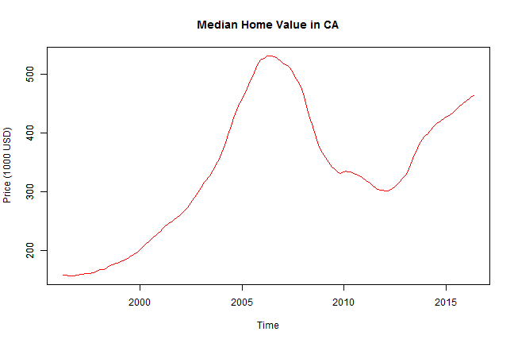

## Introduction  

The goal of this project is to build an interactive data visualization application with shiny.  

This application shows the trend of home values in California for the past 20 years (from Apr 1996 to May 2016).  

In this app, the user is allowed to input a time range of interest, and the app uses the input time range to generate a plot of *median home value (in 1000USD)* vs *time*. 

---  

## Data   

The median home value used in this app is based on Zillow Home Value Index, which is created from estimated sale prices on every home.   

This index serves as a comprehensive and robust benchmark of home value trends because it has estimated sale prices not just for the homes that were sold, but for **all homes** even if they didn't sell in that time period.  

The data for this application was downloaded from :   

http://files.zillowstatic.com/research/public/State/State_Zhvi_AllHomes.csv  

---  

## Features I  
 
The application includes:  

**ui. R**  

1. date range input by user 
2. default: 1996-04-01 to 2016-05-01  

**server.R**  

1. plot output of Median Home Value in CA in the time frame entered by user  
2. default plot: Median Home Value between 1996-04-01 to 2016-05-01  

---    

## Features II  

Example Plot: 

---   

## More Information   

The app can be accessed at:  

https://yanfei-wu.shinyapps.io/Shiny/  

The *ui.R* and *server.R* codes can be accessed at:  

https://github.com/yanfei-wu/Shiny-Application  

